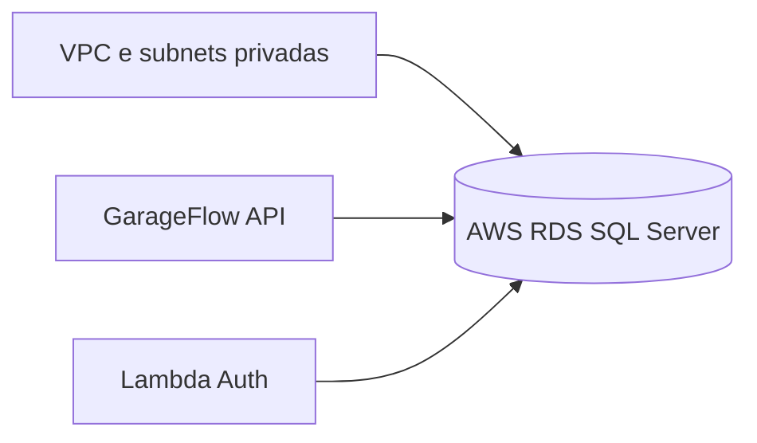

# fiap-garageflow-db-infra

Terraform para provisionar o SQL Server do GarageFlow na AWS RDS, incluindo VPC, subnets privadas, NAT, Security Group e subnet group do RDS.

## Pre-requisitos

- AWS CLI configurada: `aws configure`
- Terraform 1.8 ou superior
- Permissoes AWS para VPC, EC2, RDS e S3

Confirme o acesso antes de continuar:

```powershell
aws sts get-caller-identity
```

## Variaveis Terraform

| Variavel | Obrigatoria | Padrao | Descricao |
|---|---:|---|---|
| `aws_region` | Nao | `us-east-2` | Regiao AWS |
| `sql_db_name` | Nao | `garage-flow` | Identificador e nome do banco |
| `sql_db_user` | Nao | `garage_flow` | Usuario do RDS |
| `sql_db_password` | Sim | - | Senha do RDS |
| `allowed_db_cidr_blocks` | Nao | `10.0.0.0/16` | Redes autorizadas na porta 1433 |

Nao grave a senha em `vars.tf` ou em arquivos commitados. No PowerShell, use uma variavel de ambiente:

```powershell
$env:TF_VAR_sql_db_password="sua-senha-forte"
```

## Provisionamento

```powershell
cd terraform
terraform init
terraform validate
terraform plan
terraform apply
```

Depois do `apply`, obtenha o endpoint:

```powershell
terraform output -raw sql_endpoint
```

Se o comando nao retornar output, este diretorio nao esta usando o state que criou o RDS. Nesse caso, consulte o endpoint em `RDS > Databases > garage-flow > Connectivity & security` ou configure o backend remoto correto.

## Dependencias de rede

O RDS e privado e escuta na porta `1433`. A API no EKS e a Lambda precisam estar na mesma VPC, ou em redes conectadas, e seus Security Groups precisam ser autorizados no Security Group do RDS.

Antes de subir o EKS, compare a VPC do RDS com a VPC definida em `terraform/main.tf` do repositorio Kubernetes.

## CI/CD

O workflow `.github/workflows/cd.yml` usa:

- Secrets: `AWS_ACCESS_KEY_ID`, `AWS_SECRET_ACCESS_KEY`, `SQL_DB_PASSWORD`
- Variable: `AWS_REGION`

## Arquitetura


