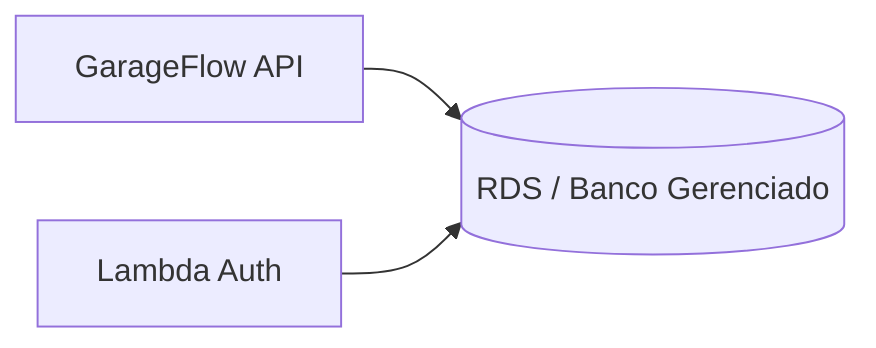

# fiap-garageflow-db-infra

## Objetivo
Provisionar o banco de dados gerenciado para a aplicação, com rede, segurança, backup e configurações de produção.

## Tecnologias
- Terraform
- AWS RDS
- PostgreSQL
- Security Groups
- Backups automatizados

## Estrutura
- terraform/
- .github/workflows/

## Arquitetura

